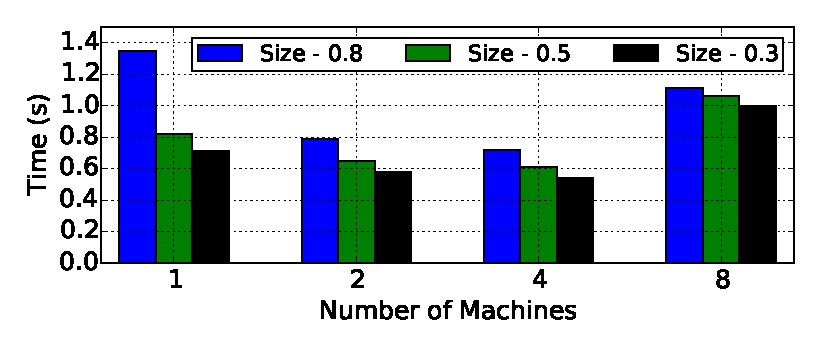

## Distributed Implementation

To support fast and scalable sampling for graphs of any size, we have opted for a distributed version of the sampling phase. Thus, we have implemented a distributed version of TIES using MPI. In this implementation the edges of the input graph are distributed over multiple compute nodes. Furthermore, each compute node has the responsibility to determine the size of its sample, compute it locally, and store its own set of vertices (i.e., its own vertex sample) in the output graph. 

Each node performs an edge-based vertex sampling locally. The edges with both endpoints on the same node pose no challenge, and these endpoints are added immediately. However, some edges will be shared'between compute nodes: one of the endpoints could be the responsibility of another, remote compute node. To enable coherent processing, compute nodes exchange a list of vertices they want to include, such that the vertices can be added to the vertex sample of the responsible node. 
The algorithm continues with the induction step, which consists of several rounds (one per compute node), in which the nodes broadcast, one by one, their local vertex sample. The other nodes decide on including or excluding the edges for which they can make a decision given the broadcasted vertex sample. 
We note that the core of the induction phase is accelerated using a GPU, which enables both a speedy execution of the induction, as well as an overlapping of the processing with the node-to-node communication.   

Due to the distributed vertex selection, the chance of collision (sampling the same vertex) grows when more compute nodes are working on the same graph. For the current implementation, we simply ignore the problem by removing duplicates. This collision mitigation approach, i.e., discarding successfully sampled vertices by different nodes because they are duplicates, has a slight impact on the sampled graph: the number of vertices could be somewhat lower than required.

For the combination phase, we use a straightforward centralized algorithm, currently running on a single compute node. Its main steps are: (1) run the sampling algorithm $n$ times, according to the user requirements, (2) collect the samples, (3) select the bridge nodes from each sample, and (4) recombine the samples based on the user-selected topology. These operations are less sensitive, performance-wise, to the size of the input graph. 

### Performance (Distributed)
We have analyzed the execution time and scalability of our tool. The execution of the tool is composed of I/O operations (reading/writing graphs from disk), a sampling phase executed multiple types (as directed by the user), and a combining phase where the bridge-vertices are selected and the new edges are introduced. The most compute-intensive phase is the sampling one, which is repeatedly invoked. Therefore, we only include here a brief analysis of the performance of this sampling step, which is heavily dependent on the input graph, the sample size, and the numbers of nodes participating in the computation.

The figure below shows the time required for sampling the Com-Orkut graph with three different sample sizes on increasingly larger clusters (featuring 1, 2, 4, and 8 identical computing nodes). We observe that the sampling takes between 1.3s and 0.5s, and the operation scales well up to 4 nodes. When scaling up to 8 nodes, we notice a slowdown, which is explained by the large communication overhead. We have obtained similar results for the largest graph used in this work, an RMAT graph with 43.74 million vertices and 1.2 billion edges: sampling this graph on 8 compute nodes takes around 5s for a 0.3 factor and slightly over 20s for a 0.8 factor.

